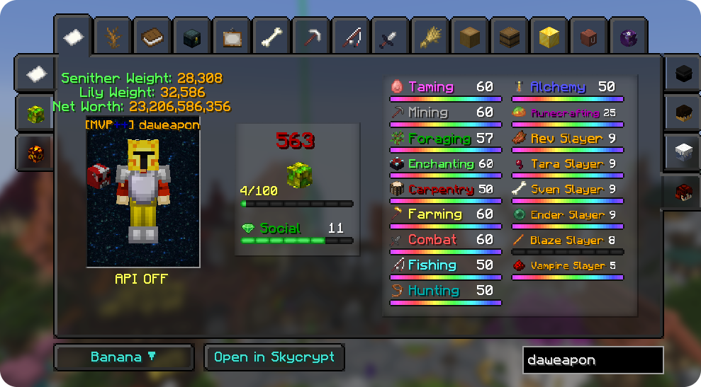

# Better PV

Better PV is a Hypixel SkyBlock **profile viewer** mod for Fabric on Minecraft 26.1.2 and 26.2. It's a port of the Profile Viewer from the old Minecraft 1.8.9 [NotEnoughUpdates](https://github.com/NotEnoughUpdates/NotEnoughUpdates) mod, brought to modern Minecraft and updated for Hypixel's current API and SkyBlock. Type `/pv <player>` to see any player's SkyBlock profile in game: skills, dungeons, collections, pets, storage, Heart of the Mountain, trophy fish, bestiary, farming and the garden, foraging, loadouts, museum, chocolate factory, the Rift and more. There's no stats website to open, and **no API key is needed**.

## Features

- Skills, slayers, SkyBlock level and net worth on one page, with a 3D model of the player
- A SkyBlock Level breakdown showing where every point of XP comes from
- Dungeons, collections, pets, Heart of the Mountain, bestiary and trophy fish
- Storage, sacks, wardrobe and loadouts
- Farming and the garden, foraging, Crimson Isle, museum, chocolate factory and the Rift
- Recently viewed players, and right-clicking a name in SkyBlock chat to open their profile
- A settings screen (`/bpv`) to turn tabs on or off, pick the opening tab, abbreviate big numbers and hide net worth
- No API key needed

...and many more!

## Installing

1. Install [Fabric Loader](https://fabricmc.net/use/) 0.19.3 or newer for Minecraft 26.1.2 or 26.2. The Minecraft launcher provides the Java 25 it needs.
2. Download [Fabric API](https://modrinth.com/mod/fabric-api) for your Minecraft version and put it in your `mods` folder.
3. Download the latest Better PV jar from this repo's [Releases](https://github.com/daweapon/BetterPV/releases) and put it in your `mods` folder too. Every release has one jar per Minecraft version: `Better-PV-<version>-mc26.1.2.jar` and `Better-PV-<version>-mc26.2.jar`. Use the one that matches your game.
4. Launch the game and join Hypixel. That's it: Better PV fetches profile data through its own server, so you don't need a Hypixel API key.

The first time you start the game, Better PV downloads the NotEnoughUpdates item repo, which has item icons, pets and the bestiary and HOTM layouts. It needs an internet connection for this.

### Optional

- **Item textures:** with the official Hypixel SkyBlock resource pack enabled, items show their SkyBlock textures instead of the vanilla ones.

## Usage

| Command | Description |
| --- | --- |
| `/pv [player]` | Opens the profile viewer for a player (yourself if no name is given). |
| `/peek [player]` | Prints a quick summary of a player's stats in chat. |
| `/bpv` | Opens the Better PV settings screen. The viewer also has a Settings button under it. |

## Settings

`/bpv` opens a settings screen in the style of NotEnoughUpdates' old config menu. Everything saves the moment you change it, to `config/betterpv/config.json`.

- **Opening Tab:** reopen on the last tab you used, or always start on a tab you pick. Applies when the viewer is opened from `/pv` or a chat click.
- **Short Numbers:** show big numbers abbreviated (12.3m instead of 12,345,678).
- **Hide Net Worth:** hide the net worth and its breakdown on the Your Skills tab.
- **Chat Right-Click:** turn the right-click-a-name feature in SkyBlock chat on or off.
- **Tabs:** switch any tab off except Your Skills. Hidden tabs still load their data, since other pages (such as the Level page) read it.

## Building

Better PV is built from one source tree for several Minecraft versions. `versions/<minecraft version>.properties` lists the Minecraft and Fabric API versions for each one, and `versions/<minecraft version>/client/java` holds the few classes that differ between game versions.

- `.\gradlew.bat build` builds the default version (26.1.2).
- `.\gradlew.bat build "-Pmc=26.2"` builds a specific version.
- `.uildAll.ps1` builds every version and puts the jars in `build/dist`.

To support a new Minecraft version, add a `versions/<version>.properties` file and, if needed, a `McCompat` class for it.

## Credits

- **NotEnoughUpdates.** Better PV is a port of the Profile Viewer from [NotEnoughUpdates](https://github.com/NotEnoughUpdates/NotEnoughUpdates), created by Moulberry and developed by the [NotEnoughUpdates contributors](https://github.com/NotEnoughUpdates/NotEnoughUpdates/graphs/contributors) for Forge 1.8.9. Most of the profile viewer's logic, layouts and textures are their work. Better PV brings it to modern Fabric, adapts it to Hypixel's current API and SkyBlock updates, and leaves out NEU's other features. It also uses NEU's community-maintained [item repo](https://github.com/NotEnoughUpdates/NotEnoughUpdates-REPO) for item, pet, bestiary and HOTM data. Their original copyright notices are kept in every ported source file.
- **SkyBlockPv.** Portions of this code are from the [SkyBlockPv](https://github.com/meowdding/skyblock-pv) mod.
- **SkyBlock level task values.** The per-task SkyBlock XP in `sblevel_tasks.json` (Level page) comes from the Hypixel wiki's SkyBlock Levels tables, via the community dataset [SkyblockXP-BAZALRIGHT-](https://github.com/8Doc/SkyblockXP-BAZALRIGHT-) by 8Doc.
- **Hypixel SkyBlock Resource Pack.** The trophy fish icons in `assets/hypixel_skyblock` are from the official SkyBlock Resource Pack, copyright Hypixel Inc. They are bundled free of charge under the pack's [license](src/main/resources/assets/hypixel_skyblock/LICENSE), which lets Hypixel-related apps use its assets. Better PV is not endorsed by Hypixel.

## License

LGPL-3.0, the same license as NotEnoughUpdates (see [COPYING](./COPYING) and [COPYING.LESSER](./COPYING.LESSER)). The code taken from SkyBlockPv is under the SkyBlockPv license (MIT with an attribution requirement).
